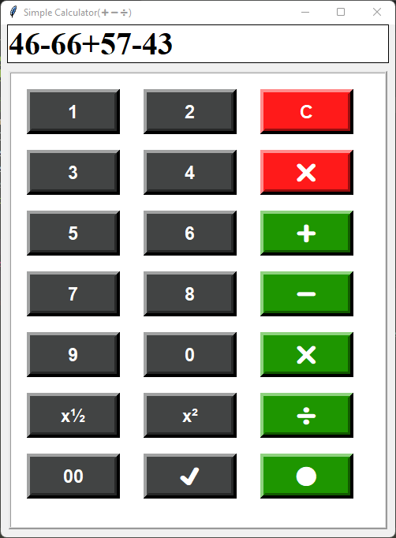

# 🧮 Simple Tkinter Calculator

This is a **simple calculator application** built with **Python** using the **Tkinter GUI library**.  
It allows users to perform basic arithmetic operations through a clean and user-friendly graphical interface.

---

## ✨ Features
- User-friendly **GUI with Tkinter**
- Supports basic math operations (+, −, ×, ÷)
- Error handling for invalid inputs
- Minimal and clean design

---

## 🚀 Getting Started

### Prerequisites
Make sure you have **Python 3.x** installed.  
Tkinter comes pre-installed with Python, so no extra installation is required.

### Run the Calculator
```bash
Simple_Calculator.py
## 📸 Screenshots

## 📸 Screenshots

Here is how the calculator looks in action:



